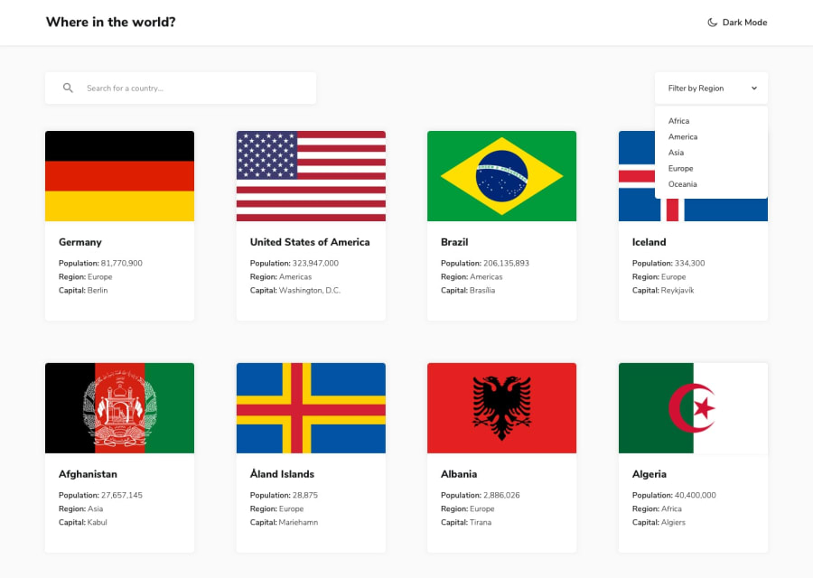

# Frontend Mentor - REST Countries API with color theme switcher solution
- View Demo: [https://63036ef0960187005b2c84f1--super-cool-site-by-duyen-codes.netlify.app/](https://63036ef0960187005b2c84f1--super-cool-site-by-duyen-codes.netlify.app/)

This is a solution to the [REST Countries API with color theme switcher challenge on Frontend Mentor](https://www.frontendmentor.io/challenges/rest-countries-api-with-color-theme-switcher-5cacc469fec04111f7b848ca).

## Overview

### The challenge

Users should be able to:

- See all countries from the API on the homepage
- Search for a country using an `input` field
- Filter countries by region
- Click on a country to see more detailed information on a separate page
- Click through to the border countries on the detail page
- Toggle the color scheme between light and dark mode

## My process

### Built with

- Semantic HTML5 markup
- CSS custom properties
- Flexbox
- CSS Grid
- Mobile-first workflow
- ReactJS

### Useful Resources

- Add custom environment variables: [https://create-react-app.dev/docs/adding-custom-environment-variables/](https://create-react-app.dev/docs/adding-custom-environment-variables/)
